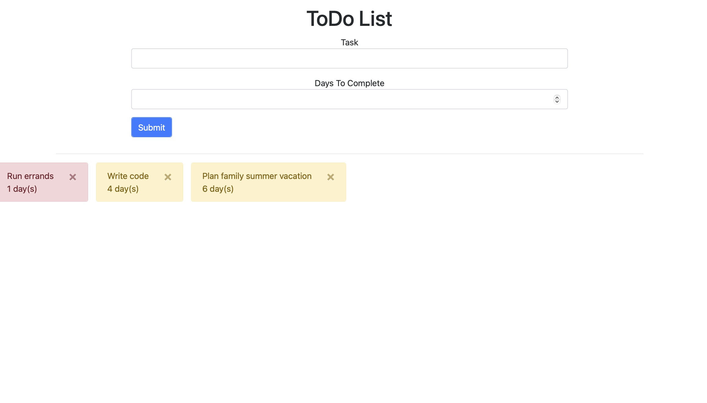
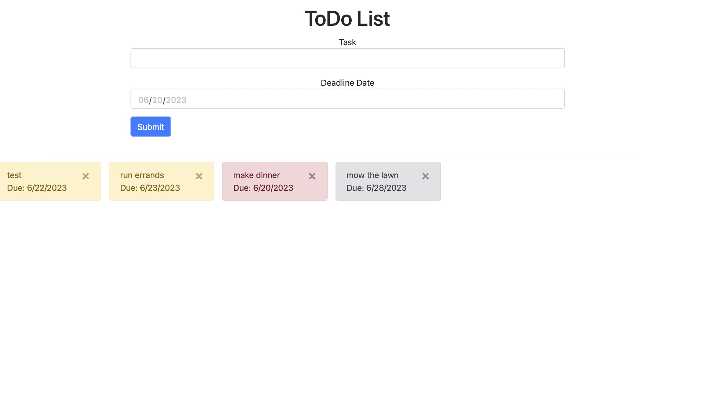

# gen10Dev10PreTrainingProject

Before starting Genesis10's Dev10 Java bootcamp, everyone in my cohort and I worked on a review project from the quick course we went through during the interview process: a small To-Do list app. This app takes in the task you want to accomplish and either the number of days it will take to finish (that's V1) or the due date you want to have it done by (V2). The list of your tasks appear below in colors indicating priority level. I made both versions to test myself with different kinds of form inputs and use JavaScript date functions.

### Demo Views

V1 - Input the number of days

V2 - Input the due date

### Links

- [Live Demo V1](https://replit.com/@gdbecker/Pre-Training-Project-V1)
- [Live Demo V2](https://replit.com/@gdbecker/Pre-Training-Project-V2)

## Author

- Website - [Garrett Becker]()
- Replit - [@gdbecker](https://replit.com/@gdbecker)
- LinkedIn - [Garrett Becker](https://www.linkedin.com/in/garrett-becker-923b4a106/)